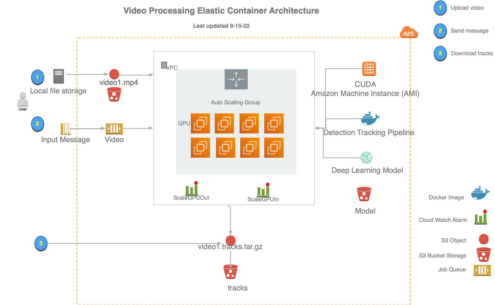

# Developer Notes for CDK 
- API reference and developer guide https://docs.aws.amazon.com/cdk/api/v2/
- Best practices for CDK https://docs.aws.amazon.com/cdk/v2/guide/best-practices.html
- Asset guide https://docs.aws.amazon.com/cdk/v2/guide/assets.html . Useful for understanding S3, Lambda, and Docker assets
- Best practice examples using SPOT instances https://github.com/awslabs/ec2-spot-labs
- Nice full-stack app for scaling/monitoring https://github.com/awslabs/scale-out-computing-on-aws
- [Gist with scaling up/down example](https://gist.githubusercontent.com/gandroz/1927f37bdb1427fdf0c641b8bbcd6f3d/raw/a42dcd4cee496090c87b03d68c0b22c02d358ffe/my_stack.py)
  

## To force the deletion of a stack

- Create an IAM role that can do this, e.g. cloudformation-omnipotent
- Delete a stack from the command line with

```
aws cloudformation delete-stack --role-arn arn:aws:iam::872338704006:role/cloudformation-omnipotent --stack-name SimStack902005
```

## To use a specific AWS profile with the awscli

```
export AWS_PROFILE mbari
```


Interacting with the ECS stack is done through [CDK](https://aws.amazon.com/cdk/). 
The CDK is installed through the yarn install command below.  
 
## Architecture

The architecture of the video processing stack includes a SQS messaging queue to perform the processing and an autoscaling
ECS cluster optimized for fast spin-up and fast spin-down of computing resources. Simply upload a video and
submit a job with the location of that video to the queue to start processing.   The result is returned to a S3 bucket.



## Requirements for development
- AWS account with full permission to provision EC2 instances, create buckets, and setup job queues and definitions.
- Node 14

The CDK is a node application, so you need to install it through a node package manager, e.g.
with npm
```
npm install
```

or with yarn
```
yarn install
```

Setup your account and default region.
```
export CDK_DEFAULT_ACCOUNT XXXXXXXXX
export CDK_DEFAULT_REGION us-west-2
```

At this point you can now bring up the cluster.

```
yarn cluster-up
```

When you are done using this, the stack can be removed with 
```yarn cluster-destroy```.  

**The s3 buckets must be empty, or removed before destroying the cluster.**

You will want to first be sure to fetch all the processed data. For example, to fetch the data and save to a directory
called tracks
```
mkdir tracks
aws s3 sync tracks s3://lonny33k-tracksb64edfdc-1hlcdhf915ahy
```

```
yarn cluster-destroy
```

##  Cluster Stacks

### DeepSort YOLOv5

`cluster/stacks/ecs_task_autoscaling.ts` defines a detection and tracking pipeline designed to process underwater video with a [MBARI Monterey Bay Benthic Object Detector](https://doi.org/10.5281/zenodo.5539915) trained on YOLOv5.

If you have a model to use instead that is a YOLOv5 model, simply upload the model and your tracking configuration in the buckets defined in the json file `cluster/stacks/deepsort_yolov5.json`
then run

```
cdk synth
cdk deploy
```

## Quick test of your cluster

Upload video to generated stack *video* bucket, e.g.

```
 aws s3 cp  data/M3/mezzanine/V4244_20191205T165023Z_h264.mp4 s3://lonny33k-videoc740e53c-1jgaxnwvy7rwd/data/M3/mezzanine/V4244_20191205T165023Z_h264.mp4
```

Submit job to the autogenerated *video* queue in your region, e.g. us-west-2 queue *lonny33k-ecsqueuelonny33k3AABC591-RrCPqVBsM02P.fifo*

```
aws sqs send-message --queue-url https://us-west-2.queue.amazonaws.com/lonny33k-ecsqueuelonny33k3AABC591-RrCPqVBsM02P.fifo \
--message-body """ { 
\"video\": \"data/M3/mezzanine/V4244_20191205T165023Z_h264.mp4\" ,
 \"clean\": \"True\",
 \"job_name\": \"Dive4244\"  
 \"user_name\": \"dcline\"  
} """ 
--message-group-id 33k
```

A few minutes later, you should see the data completed and available in the generated *track* bucket
```
aws s3 ls s3://lonny33k-tracksb64edfdc-1hlcdhf915ahy/data/M3/mezzanine/
```


## Useful cdk commands

* `cdk ls`          list all available stacks
* `cdk synth`       emits the synthesized CloudFormation template; run only when changes are made; useful to follow with cdk diff
* `cdk diff`        compare deployed stack with current state
* `cdk deploy`      deploy this stack to your default AWS account/region
* `cdk docs`        open CDK documentation
* `cdk destroy`     remove the stack from your default AWS account/region