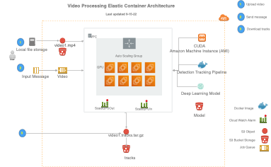

# Deploying a model in the Elastic Container Service

The elastic video processing stack manages the deployment of a model in the Elastic Container Service (ECS).
This stack is designed to be used with the [ecsprocess](/commands/process) command.
These instructions assume that you have already trained a model using the [train](/commands/train) command
and know the location of that model in S3.  If you have not trained a model, see the [train](/commands/train) command
for more information.

## Architecture

The architecture of the elastic video processing stack includes:

 * A cloud watch alarm that triggers the auto scaling based on number of videos in a SQQ queue.
 * An autoscaling ECS cluster optimized for fast spin-up and fast spin-down of computing resources. 

When the [ecsprocess](/commands/process) command is executed, video is uploaded to a S3 bucket then a message is sent to a video
SQS queue. Messages are sent as soon as each video is successfully uploaded. This triggers a cloud watch alarm to 
start scaling up the ECS cluster.  The ECS cluster will start mulitple tasks to process the video, and these tasks 
will continue to process as long as videos messages are in the queue. When the queue is empty, the container will 
stop processing and the ECS cluster will scale down, removing resources to save costs. Results are stored in a S3 bucket
as a .tracks.tar.gz file which can be downloaded and analyzed.

[click image below to see larger example]
 
[](https://docs.mbari.org/deepsea-ai/imgs/ecs_arch.png)

 
## Deploying a new model

The following is the YAML formatting that describes the model. 
 
 * The **StackName** is the name of the stack that will be created in the cloud formation console. This name must be unique and will be used with the [ecsprocess](/commands/process) command, e.g. --cluster Megadetector.
 * The **TaskDefinition** is the name of the ECS task definition that will be created.  
 * The **ContainerImage** is the location of the docker image that will be deployed.  This corresponds to the docker image that was uploaded with the [setup](/commands/setup) --mirror command.
 * The **FleetSize** is the number of CUDA enabled Amazon Machine Instances that will be deployed. This is limited to whatever quota you have requested in your account.

### Example YAML file

Create a .yaml file with this content, e.g. megadetector.yaml in the current directory.

!!! info inline end 
      Note that the **StackName** cannot start with a number, and be sure to replace the account number 168552337187 with your account number.

```yaml
Comment: This stack deploys the Megadetector YOLOv5 model
StackName: Megadetector
TaskDefinition: strongsort-yolov5
ContainerImage: 168552337187.dkr.ecr.us-west-2.amazonaws.com/mbari/strongsort-yolov5:1.10.0
FleetSize: 1
model_location: s3://deepsea-ai-168552337187-models/Megadetector.pt
track_config: s3://deepsea-ai-168552337187-track-conf/strong_sort_benthic.yaml
```

Then deploy the stack with the following command:
 
### Deploy with the YAML file and save the stack output

Deploy and save the stack output to a directory, e.g. to directory named `stacks/megadetector`:

First create the directory to save the stack output. This just captures the cloud formation output 
and is useful for debugging.

```shell
mkdir -p stacks/megadetector
```
Then deploy the stack with the following command which will save the output to the directory `stacks/megadetector`:
  
!!! info inline end 
      Note that your AWS credentials must be setup in the ~/.aws/credentials file.  See the [AWS CLI documentation](https://docs.aws.amazon.com/cli/latest/userguide/cli-configure-files.html) for more information.

```shell
docker run -v $PWD:/data \
            -v $HOME/.aws/credentials:/home/docker_user/.aws/credentials \
            mbari/ecs-autoscale \
            /data/megadetector.yaml \
            /data/stacks/megadetector
```

